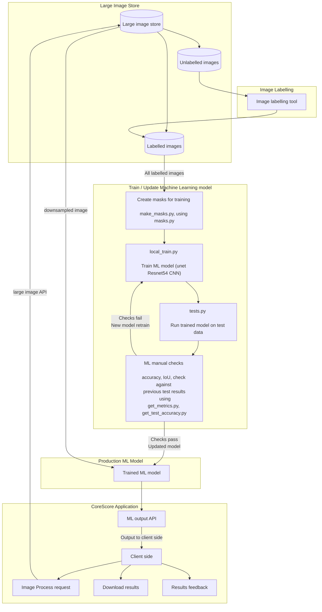

# Core Analyses Project

This project provides an analysis of the quality of the cores in the [British Geological Survey](https://github.com/BritishGeologicalSurvey) [Core Store](https://www.bgs.ac.uk/collections/corestore_kw.html) based on core photography. It was originally an MSc project by Zayad Al Zaher, co-supervised by Mark Fellgett at BGS. It's since been adopted by BGS Digital Labs and extended for production use.

We've added integration with [MLFlow](https://github.com/mlflow/mlflow) to monitor and manage model training runs, and an API designed for use within [LabelTool](https://github.com/Slava/label-tool) to help speed up the process of adding annotations to core images.


## Installation notes

Install pytorch and torchvision from conda:

```
conda install pytorch torchvision cudatoolkit=10.2 -c pytorch
```

We plan to move to fastai v2 when it becomes available in MLFlow; for now, one needs to pin the fastai version to 1 in the filei `conda_meta/pinned` in virtual environment.

```
echo 'fastai 1.*' >> $CONDA_PREFIX/conda-meta/pinned
conda install -c fastai -c pytorch fastai
```

Other dependencies via pip

```
pip install -r requirements.txt
```

The notebook includes an animated progressbar for which we need `ipywidgets` enabled

```
pip install ipywidgets
jupyter nbextension enable --py widgetsnbextension
```

## BGS Core Processing workflow

First of all why do this? Essentially classical edge detection workflows do not work very well on images that are not pre-processed or taken in a way where there is good contrast. Picking the right threshold value is also tedious and can take some time, even contouring and finding the correct contours needs to be done per image for optimal results. 


Project updated to include the machine learning workflow for segmentation as well as the various other workflows that follow.

There are several files some of which are used to generate the masks that are then used to train the model and the rest are used to also get the areas from the core after its processed.

A total of 33 training images were used- 4 of which were used for validation throughout the training process - the model was then tested on additional pictures and the accuracy of the model was assesed qualitatively, depending on the accuracy for the purpose.


The images are then put into the machine learning model and predictions are then made based on what it has previously learnt, example of the ML output (Through segmentation and Unet as implemented in fastai)

The example below is of a prediction on an untrained example:


The final output from the images themselves looks like what is below- with varying accuracies depending on how well the mask worked


## CoreScore Application Flowchart


## Contributors

 * Zayad Al Zaher
 * Mark Fellgett
 * Jo Walsh
 * Vyron Christodoulou
 * Alex Hall

We welcome any contributions to code or issues.

## Acknowledgements

We're grateful to the maintainers of [corebreakout](https://github.com/rgmyr/corebreakout) for their work with BGS Core Store data on [Subsurface Core Images to Depth-Registered Datasets](https://joss.theoj.org/papers/10.21105/joss.01969)  and hope to provide our own annotations for the BGS images that project provides as training data.


