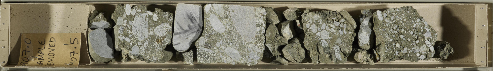
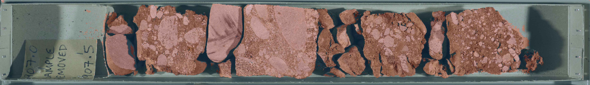
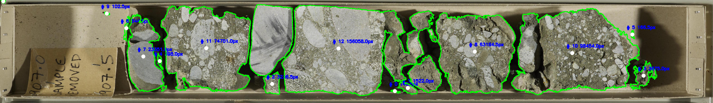

# Core Analyses Project
BGS Core Processing workflow

Project updated to include the machine learning workflow for segmentation as well as the various other workflows that follow.

There are several files some of which are used to generate the masks that are then used to train the model and the rest are used to also get the areas from the core after its processed.

A total of 33 training images were used- 4 of which were used for validation throughout the training process - the model was then tested on additional pictures and the accuracy of the model was assesed qualitatively, depending on the accuracy for the purpose.

The images are then put into the machine learning model and predictions are then made based on what it has previously learnt, example of the ML output (Through segmentation and Unet as implemented in fastai)

The example below is of a prediction on an untrained example:

The final output from the images themselves looks like what is below- with varying accuracies depending on how well the mask worked

